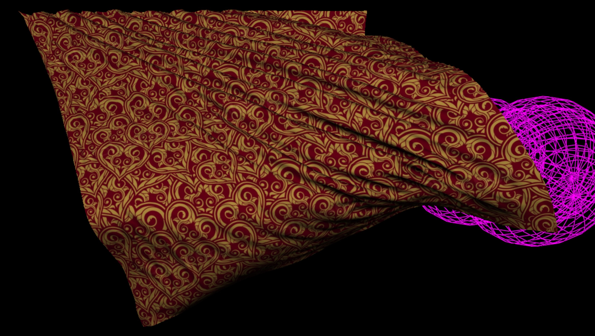
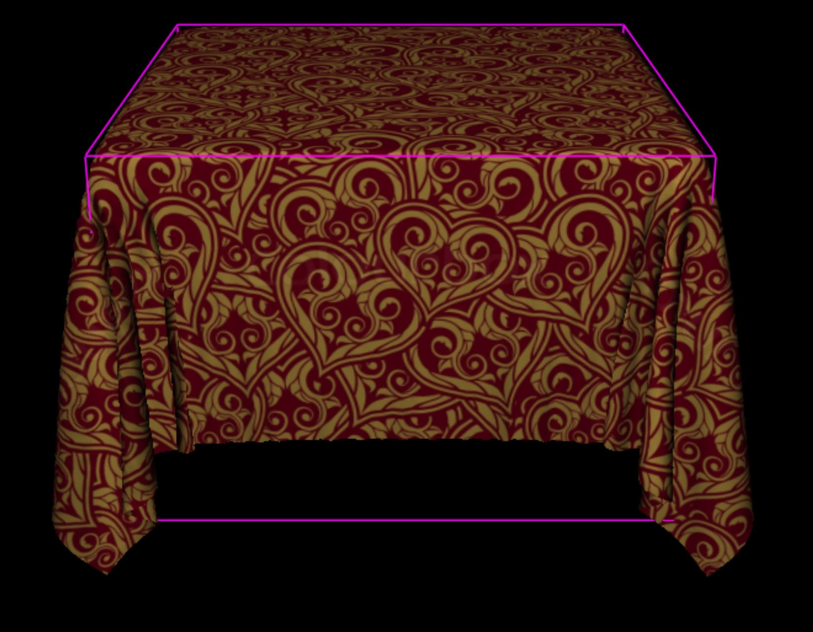

# ClothDemo
An interactive, physically-based cloth demo in C++ using OpenGL, GLUT, GLEW, and CMake

##
This is a demo of physically-based cloth using techniques described by Thomas Jakobsen in Advanced Character Physics, GDC 2001. It uses Verlet integration and multiple iterations of constraint satisfaction, with Rod, Slider, and Point constraints, and collision with moving objects.
https://www.gpgstudy.com/gpgiki/GDC_2001:_Advanced_Character_Physics

I've only built this on Windows on Visual Studio 2019 lately. Hopefully Linux will just work.

##
This core code was originally written by fellow grad students at UNC Chapel Hill in 2001 or 2002. Probably Paul Rademacher or Mark Harris, but I'm not sure. I've had it squirreled away for the last twenty years and decided to get it working yesterday as part of another project.

I've improved the code enormously, fixing several bugs, adding new modes, adding a working AABB collision object, improving the graphics quite a bit, and increasing all of the constants to levels suitable for 60 fps on my machine, a 2021 Dell XPS 17 with an Nvidia RTX 3060.

I've parallelized the code on the CPU simply by using std::for_each(std::execution::par_unseq, ...). Parallelizing the constraint computation makes a big difference.

##
Builds for me using CMake 3.20, Visual Studio 2019, freeglut-3.2.2, glew-2.2.0.

This also depends on my DMcTools library. This is my graphics tools that I've been using and evolving for the last 25+ years. Grab it from https://github.com/davemc0/DMcTools.git and place DMcTools/ in a directory adjacent to ClothDemo/.

